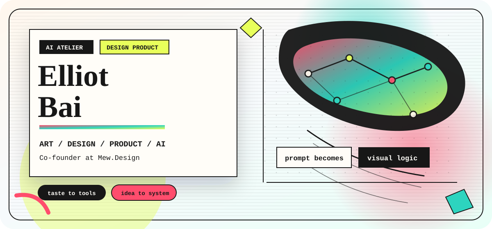
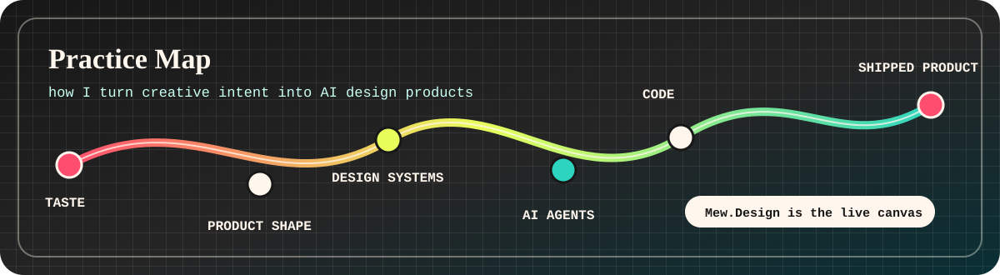

  

  
  
  

### I build AI design products like an atelier, not a dashboard.

I'm **Elliot Bai**, co-founder of [Mew.Design](https://mew.design). I work where art direction, product taste, and AI systems meet: turning fuzzy creative intent into visual outputs people can actually edit, use, and ship.

I care about the whole loop: the feeling of the first prompt, the product surface, the generation pipeline, the rendering infrastructure, and the tiny interaction details that make AI feel less like a tool and more like a creative partner.

### What I'm shaping

| Studio work | Why it matters |
| --- | --- |
| **Mew.Design** | A live AI design canvas for generating graphics, layouts, and creative directions from natural language. |
| **Human-like AI designers** | Agents that understand taste, context, revision, and client intent instead of only producing one-off images. |
| **Prompt-to-visual systems** | Workflows where a rough idea becomes composition, copy, image direction, and editable design structure. |
| **Creative infrastructure** | Screenshot, rendering, and automation systems that make AI-generated design feel fast and production-ready. |

### Selected pieces

| Piece | Signal |
| --- | --- |
| [Mew.Design](https://mew.design) | Product vision, AI design workflow, creative collaboration. |
| [screenshot](https://github.com/bkidy/screenshot) | Rendering service behind visual product workflows. |
| [MagoUI](https://github.com/bkidy/MagoUI) | Prompt-to-interface experiments and local AI prototyping. |
| [Awesome-GPT-Store-Zh](https://github.com/bkidy/Awesome-GPT-Store-Zh) | Early AI ecosystem curation and pattern watching. |

### Materials

`Product taste` / `art direction` / `AI agents` / `TypeScript` / `React` / `Wasp` / `Node.js` / `Python` / `PostgreSQL` / `Cloudflare` / `AWS` / `Figma`

### Studio door

[Mew.Design](https://mew.design) / [Email](mailto:bkidyy@gmail.com) / [X](https://twitter.com/bkidallen)
